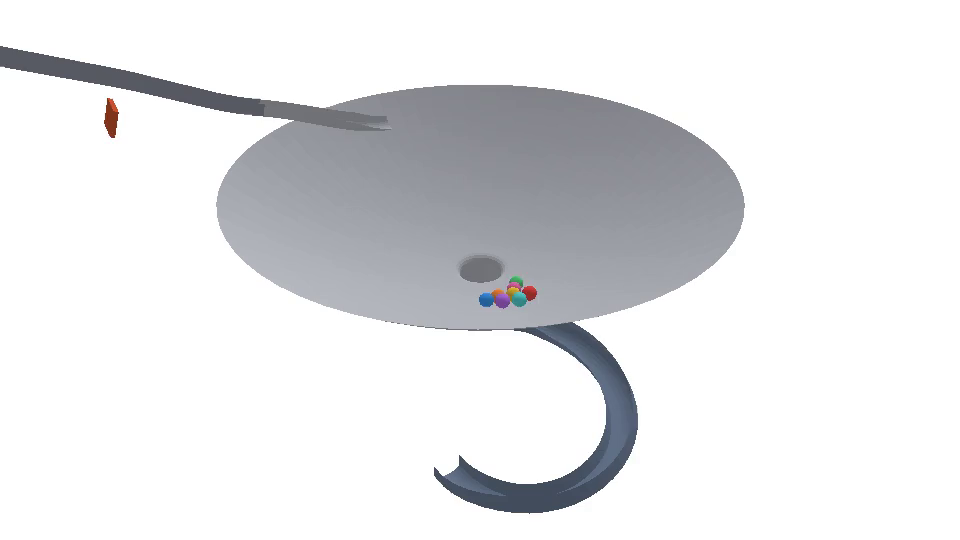

# The marble physics core: a production PyBullet engine for true 3D marbles

`marble3d/`, on `marble-physics-core`, branched from the physics lab's head at
`53a9ee1`. This is the production hardening of Recommendation B from
[`physics_lab_bowl_comparison.md`](physics_lab_bowl_comparison.md): Python stays
authoritative, PyBullet does the physics, a deterministic replay carries the
result, and Godot draws the replay without re-simulating it.

Nothing here is merged and nothing in `race/`, `replay/`, `rendering/` or
`godot/` has been touched. The lab's `physics_lab/` experiments are untouched
too — this is a separate package, and the lab is the evidence it rests on.

Every number in this document comes out of `tools/marble3d_validate.py --all`,
which writes [`validation/marble3d/hardening.json`](validation/marble3d/hardening.json).
None of them is typed.

---

## 1. Why PyBullet, and what that decision actually bought

The lab compared four approaches on one bowl benchmark and measured this:

| approach | median revolutions before draining |
| --- | ---: |
| production pymunk 2D bowl | 0.46 |
| Python 2.5D surface physics | 6.01 |
| PyBullet true 3D | 4.06 |
| Godot / Jolt true 3D | 6.33 |

All three prototypes cleared every believability threshold and all three were
byte-identical over 20 in-process and 20 cross-process repeats, so the choice
was never about quality or determinism. It was decided by two things.

**Generality.** A height field `y = f(x, z)` is single-valued. A tube, a
bridge, a vertical drop and a stacked track all need two surfaces over one
ground point, and those are what a marble machine is made of. The 2.5D model is
not slightly less general than a 3D engine; it cannot express the defining
feature of the thing being built. Section 6 of this document is the
demonstration.

**Speed and architecture.** Godot/Jolt runs at about 1× realtime, 20–30× slower
than either Python-authoritative option, which disqualifies it for seed search
on its own; and making it authoritative inverts the pipeline, putting physics
downstream of the replay it is supposed to produce. PyBullet keeps Python in
charge, so the seed search, the offline render and the byte-exact replay all
survive.

The cost is a compiler dependency. There is no cp313 Windows wheel for
PyBullet 3.2.7; pip builds a 76.8 MB source tarball against MSVC 2022. It
works, and it is a build requirement on every machine that would ever run a
simulation.

### What production hardening changed about that recommendation

Three things the lab could not have found, because its bowl ran at a twenty-
fifth of this scale and a fortieth of these speeds. They are in sections 2, 3
and 5, and one of them is a genuine limitation rather than a fixed bug.

---

## 2. Units: one convention, no conversions

Stated once, in [`marble3d/units.py`](../marble3d/units.py), and nowhere else.

```
1 world unit (wu) = 1 engine metre = 0.040 m of the desktop toy modelled
marble radius     = 0.5 wu     (a 40 mm glass marble at toy scale)
marble diameter   = 1.0 wu
gravity           = 245.25 wu/s^2, along -Y
axes                +Y up, gravity -Y, machine laid out in XZ
```

Gravity is not 9.81 and that is the whole of the module.

Bullet is tuned for objects around a metre across. Its default collision margin
is 0.04 world units, and against the lab's 20 mm marble that is *twice the
radius*: a marble placed at rest on the bowl wall was flung from radius 0.30 to
0.43 in half a second, gaining 0.7 m/s out of nothing, because every contact was
generated a margin deep and pushed out accordingly. Nothing about that is a fact
about rigid-body physics. It is a fact about running an engine fifty times below
the scale it expects.

The lab's answer was to simulate at 25× and report at 1×, which means a
conversion on every read and every write. This package's answer is to author at
engine scale and never convert. The marble is half a unit in radius rather than
a fiftieth, and gravity is scaled by the same factor as the geometry.

That last part is the similarity transform, and it is what makes the choice free
rather than a compromise. Under `L -> S·L`, `g -> S·g`, Newton's second law is
invariant in **time**: lengths, velocities and accelerations all scale by S, and
times, angular velocities, dimensionless ratios and every collision outcome do
not. So the machine is geometrically similar to a desktop toy and runs on the
toy's clock — a replay plays back at the tempo of the thing it models, with no
conversion anywhere. Leaving gravity at 9.81 instead would have given a
monument: correct SI, and every event `sqrt(25) = 5×` slower.

`TOY_METRES_PER_UNIT` exists for reporting and must never appear in a code path
that runs during a step. To read any number in this package: divide by 25 to get
the toy. A 12.5 wu bowl is a 50 cm bowl; 70 wu/s is 2.8 m/s; times are already
real.

---

## 3. Three engine defaults that are silently wrong

### 3.1 `createMultiBody` clamps velocity at 100 wu/s

PyBullet builds a `btMultiBody` — the articulated, reduced-coordinate body type
meant for robots — unless told otherwise. Measured on this machine at 240 Hz
with gravity off:

| asked for | `btMultiBody` delivers | `btRigidBody` delivers |
| ---: | ---: | ---: |
| 50 wu/s | 49.575 | 50.000 |
| 200 wu/s | **100.000** | 200.000 |
| 600 wu/s | **100.000** | 600.000 |

The base velocity is hard-clamped at 100, and there is a linear damping term
applied that nobody asked for. A marble that has fallen fourteen units is
already past the clamp, so a tall machine would quietly stop obeying gravity
partway down — and it would look like terminal velocity, which is a thing
marbles are allowed to have, so nobody would question the video.

`marble3d.world.MarbleWorld` passes `useMaximalCoordinates=True` on every body.
`test_marbles_are_rigid_bodies_and_are_not_velocity_clamped` is the guard.

### 3.2 CCD only works on rigid bodies, and then it is decisive

With the clamp in place `ccdSweptSphereRadius` appeared to do nothing, because
nothing could move fast enough to tunnel. On real rigid bodies — a 1.0 wu marble
fired at a 0.3 wu trimesh wall at 240 Hz, twenty starting phases per row:

| travel per tick | no CCD | with CCD |
| ---: | ---: | ---: |
| 0.25 diameters | 0/20 | 0/20 |
| 0.42 diameters | 0/20 | 0/20 |
| 0.62 diameters | 0/20 | 0/20 |
| 0.83 diameters | 1/20 | 0/20 |
| 1.25 diameters | 7/20 | 0/20 |
| 1.67 diameters | 11/20 | 0/20 |

Discrete detection is reliable to about 0.6 diameters of travel per tick and
starts leaking above it; the swept test covers everything measured. PyBullet
exposes `ccdSweptSphereRadius` but not `ccdMotionThreshold`, so this is the only
handle there is, and it is enough.

The rate is then chosen to stay in the *first* column: `MarbleConfig.travel_budget`
is 0.5 diameters, a factor of 1.7 inside the measured failure onset, and a run
measures its own worst travel per tick against it. CCD is the second line of
defence behind a rate at which the first already holds.

### 3.3 A trimesh collision margin does not do what the manual says

The standard account is that a static trimesh collides one margin *outside* its
triangles, so a marble rests one margin high. That is not what happens on this
build. Measured:

| mesh margin | resting height error | contact generated at | settles in a 1.10 wu gutter at |
| ---: | ---: | ---: | ---: |
| 0.2000 | −1e−5 | 0.018 wu of gap | 0.5010 |
| 0.0400 (Bullet default) | −1e−5 | 0.018 | 0.5010 |
| 0.0100 | −1e−5 | 0.010 | 0.5005 |
| **0.0010** (chosen) | −1e−5 | 0.001 | 0.5002 |
| 0.0000 | −1e−5 | 0.001 | 0.5002 |

Split-impulse penetration recovery resolves to contact whatever the margin was,
so the resting height is margin-independent. What the margin changes is where
contacts are *generated*, and through that the effective size of a marble in
tight geometry: in a channel a tenth of a diameter wider than the marble, a
marble at Bullet's default margin rides 0.0008 wu higher because it is being
held off both walls before it reaches either.

Small here. Not small at every scale — the same 0.04 against the lab's 0.02 m
marble was twice the radius, which is the bug in section 2.

**Policy.** Spheres need nothing: `btSphereShape` carries its margin *as* its
radius, so a 0.5 wu sphere has a 0.5 wu half-extent and two marbles touch at
exactly one diameter (measured: contact at ≤ 1.0000, clear at ≥ 1.0020).
Triangle meshes get an explicit 0.0010, which is 0.2% of a marble radius and the
point below which the measurement stops changing.

---

## 4. Friction, restitution and rolling: measured, not configured

Bullet does not let a pair of materials be specified. Every body carries one
coefficient and the solver **multiplies** them. The lab set both the marble and
the bowl to the benchmark's 0.15, got a pair coefficient of 0.0225 against a
wall needing 0.230, and every marble skidded the whole way down — which reads as
a finding about rigid-body physics rather than as an arithmetic mistake. It is
also engine-specific: Jolt combines as `sqrt(a·b)`, so a number copied between
the two engines is silently wrong.

[`marble3d/materials.py`](../marble3d/materials.py) states what is wanted for
each *pair* and solves for the per-body values:

```
mu_marble  = sqrt(mu_marble_marble)              = 0.387
mu_surface = mu_marble_track / mu_marble         = 1.291
```

and the tests do not check that the solver returns what it returns. They put a
marble on an incline and measure its acceleration. A solid sphere that rolls
accelerates at `(5/7) g sin θ`; one that skids at `g (sin θ − μ cos θ)`:

| slope | measured | `(5/7) g sin θ` | needs μ ≥ | verdict |
| ---: | ---: | ---: | ---: | --- |
| 10.0° | 30.42 | 30.42 | 0.050 | rolls |
| 20.0° | 59.91 | 59.91 | 0.104 | rolls |
| 30.0° | 87.59 | 87.59 | 0.165 | rolls |
| 41.9° | 116.91 | 116.91 | 0.256 | rolls |

41.9° is the steepest surface the bowl has, taken from the bowl rather than
written down. The negative control matters as much: starved to μ = 0.10 at 30°,
the marble skids at 101.39 against a sliding-law prediction of 101.39, and the
coefficient recovered from its acceleration is 0.100. The measurement can tell
the two regimes apart, so the four rows above mean something.

### Rolling friction is zero, and that is the measured answer

This started at a physically reasoned 0.001 — rolling resistance for glass on a
hard track is around `Crr = 0.002`, and Bullet's `rollingFriction` looked like
that coefficient times the radius. Measured on a flat trimesh, recovering
`Crr = a/g` from the deceleration of a marble rolling at 30 wu/s:

| Bullet `mu_r` | effective `Crr` | ratio |
| ---: | ---: | ---: |
| 0.0000 | 0.0023 | — |
| 0.0001 | 0.0240 | 240 |
| 0.0002 | 0.0339 | 170 |
| 0.0005 | 0.0540 | 108 |
| 0.0010 | 0.0519 | 52 |
| 0.0020 | 0.0481 | 24 |

Two findings. Bullet's rolling friction is not a rolling-resistance coefficient
in any usable sense — the effect per unit is not constant, it saturates, and
above 0.0005 it falls. It cannot be calibrated to a physical number because it
is not modelling one.

And the first row settles it. With every rolling term at exactly zero the marble
still loses `Crr = 0.0023`, because a rigid sphere loses energy at every
triangle edge it rolls over. That is already **above** the 0.001–0.002 a real
glass marble on a hard track measures. The collider dissipates more than reality
on its own, and adding a term that dissipates ten times again would bury the
effect rather than model it.

The cost of the mistake was visible before it was diagnosed: a single marble
orbiting this bowl managed **3.36 revolutions** at zero rolling friction and
**1.54** at 0.001. Collider resolution, over a threefold change in sagitta,
moved the same number by 0.08. The knob that looked physical was doing the
dissipating and the one the lab warned about was not.

Linear and angular damping are zero for the same reason and one of their own:
air drag on a marble at 2.8 m/s is about 0.45% of its weight, an order below the
collider's own floor.

---

## 5. The physics rate, and the limitation behind it

Measured on the whole machine, seed 7:

| rate | bowl turns | run | wall | worst penetration | travel/tick |
| ---: | ---: | ---: | ---: | ---: | ---: |
| 120 Hz | 2.32 | 8.7 s | 0.52 s | −0.269 | 0.41 diam |
| 240 Hz | **2.97** | 8.8 s | 1.12 s | −0.140 | 0.21 diam |
| 480 Hz | 4.58 | 12.9 s | 3.10 s | −0.071 | 0.10 diam |
| 960 Hz | 15.27 | 43.2 s | 17.98 s | −0.027 | 0.055 diam |
| 1920 Hz | 0.42 † | 45.0 s | 20.64 s | −0.004 | 0.053 diam |

† hit the time limit with marbles still orbiting; **five of eight escaped the
bowl entirely.**

The lab reported that bowl trajectories were essentially rate-independent
between 120 and 480 Hz. **That is not true of this machine, and it is the most
important caveat in this document.** The orbit lifetime rises monotonically with
the rate and does not converge: how much energy a rigid sphere loses crossing a
triangle edge is a function of the *timestep*, not only of the mesh. At 960 Hz
the marbles orbit for forty seconds. At 1920 Hz they keep enough energy to climb
over the dish edge and most of the field leaves.

Two consequences, and both belong in any decision about this architecture:

* **The geometry is tuned against the dissipation at the chosen rate.** The
  bowl's containment works because marbles lose energy at the rate 240 Hz makes
  them lose it.
* **Changing the rate is changing the machine**, not refining it. There is no
  converged answer to run towards.

240 Hz is chosen on three grounds. It is the lowest rate whose contact behaviour
is clean — 0.21 diameters of travel per tick against a measured failure onset of
0.83, and a worst penetration of 14% of a diameter against 27% at 120 Hz. It
puts the bowl at 3.0 revolutions, between the production 2D bowl's 0.46 and the
lab's PyBullet prototype's 4.06. And it costs 1.1 s a seed, so a thousand-seed
search is about twenty minutes where 480 Hz would be an hour.

Replay sampling is 60 fps, an exact quarter of the physics rate, so a replay
frame is a physics tick and never a blend of two.

---

## 6. The module system

A module is authored entirely in its **own local coordinates** and is placed by
composing socket frames. No module in this package contains a world coordinate,
and the only coordinate anyone writes down is the placement of the single
anchor — which is normally the identity.

```
MarbleModule
    local_sockets()    boundary frames: where a marble crosses, and which way
    local_colliders()  triangle meshes, in local coordinates
    local_actuators()  moving parts, as pure functions of the tick index
    local_bounds()     the region that decides which module a marble is in
    local_probes()     rays this module asserts must hit its own surface
    describe()         metadata for the replay
```

A **socket** is a frame whose `+X` is the direction of travel, `+Y` the local
up, `+Z` across the channel. Exits and entries are both stated in the direction
of travel, so connecting them is an identity rather than a 180° flip that has to
be got right in three places instead of none.

Two kinds of join:

* **Guided** — the surface is continuous, so the two frames coincide exactly.
  `T = exit_world · entry_local⁻¹`, with nothing left over. Both sides must
  admit the same marble: a guided join between different channel widths is a
  build error.
* **Drop** — the marble is in free flight, so the join constrains less and says
  exactly how much less. The downstream entry is placed a stated fall below the
  upstream exit and yawed about the world vertical until its heading matches;
  its pitch and roll are its own, because a catch basin under a drain is not
  obliged to be vertical because the drain is. The catch must be at least as
  wide as the hole feeding it.

The whole `start_bowl_curve` machine is four lines:

```python
bowl_module  = machine.anchor(BowlModule("bowl"))          # a bowl must be upright
start_module = machine.add(StartModule("start"))
curve_module = machine.add(CurveModule("curve"))
machine.connect(start_module, "exit", bowl_module, "entry")
machine.connect(bowl_module, "drain", curve_module, "entry", fall=DRAIN_FALL)
```

Move the bowl and the chute above it and the curve below it move with it, still
joined. Deepen the bowl and the chute's mouth follows the new feed angle. Widen
the drain and the join refuses to close until the catch is widened to match.

### Actuation

An actuator's pose is `pose_at(tick)` — a pure function of an integer, never of
elapsed wall clock, an accumulated phase, or the previous pose. Three things
follow, and they are the reasons for the restriction:

* a run resumed, replayed or re-simulated from tick N puts every mechanism where
  it was, with no warm-up;
* floating-point phase cannot drift, because nothing is accumulated — a rotating
  gate at tick 100 000 is `rate · 100000 · dt`, not a hundred thousand additions;
* an actuator can be evaluated **without a physics world**, so a test can assert
  that a paddle sweeps the arc it claims and a renderer can draw moving parts
  from the replay without a physics engine present.

The cost is that such an actuator cannot react — it cannot stop when a marble is
under it and it cannot be a motor with a force limit. Both are real mechanisms
and both will be wanted. When they are, they should arrive as a *second* kind,
with their state written into the replay per frame; they must not arrive as an
exception to this one, because the moment one mechanism's pose depends on run
history, resuming from a replay stops being exact for the whole machine.

Actuated bodies are mass zero: infinitely heavy to a marble, unmovable by
contact, moved by rewriting their transform between steps. A marble resting on
one is pushed out of the way rather than lifted with momentum, which is right
for a gate and wrong for a lift — a lift needs the transform *and* a matching
velocity so the solver has something to transfer, and that is a straightforward
extension when the first one is built.

### The three modules built

**Start.** An inclined chute with a shallow staging shelf, a queue of eight
marbles, and a gate that retracts on a smoothstep at t = 0.15 s. Two things in
it are load-bearing. The chute is authored *level at its mouth*, because the
machine places it by making its exit coincide with the bowl's entry — the bowl
decides the feed angle and the chute adopts it, and a chute authored as a
straight ramp would come out tilted to match with its release end at the wrong
angle. And the shelf is shallower than the chute below it: the marble at the
back of an eight-marble queue starts a queue-length further up the slope, which
on the running incline spreads the field over 2.5 wu of height and puts the back
of it above the bowl's circular-orbit speed. On the shelf the spread is 0.8 wu.

**Bowl.** A dish at `y = depth·(r/rim)^1.9`, a drain lip that is a fillet solved
for tangency with the dish, a drain shaft, and a feed spout. Power 1.9 rather
than 2.0 is a physics decision the lab measured: a true paraboloid is nearly
isochronous, so every orbit has the same period whatever its amplitude, a field
of marbles never laps itself, and the bowl records a third of the collisions.

The lip is a shape and not a threshold. A marble does not reach `drain_radius`
and get deleted — it rolls onto a convex fillet, the surface curves away under
it faster than gravity can hold it, and it leaves as a falling rigid body with
whatever speed and spin it had.

**Curve.** A banked helical channel that starts under the bowl's drain and turns
through 270° at a radius well inside the bowl's own. At every one of 41 sampled
points there is dish above and channel below at the same `(x, z)` — which is the
whole argument of section 9 of the lab's comparison, made as geometry.

Its bank comes from a speed: `tan θ = v²/gR` at the speed the drop actually
produces, ramped to zero at both sockets so a connection is not fighting a tilt.

---

## 7. What the collider validation found, and how

Section 8 of the brief says production cannot rely on visual inspection, and it
is right for a specific reason: every collider failure the lab hit produced a
plausible physics result rather than an error. A mesh truncated at PyBullet's
8192-vertex command buffer gave a bowl with **no collider at all** and a run
that reported 0.14 revolutions. A mis-ordered profile gave a phantom cone from
rim to drain, and marbles wedged against it read as "this engine has too much
friction".

Two layers, and they check different things.

**Mesh integrity**, in pure Python before Bullet sees anything: vertex and
triangle counts, index bounds, degenerate indices and areas, longest edge,
directed-edge manifoldness and winding consistency, connected components, a
byte-exact round trip through the OBJ writer, and that chunking preserves every
triangle. Fast, unit-testable, and it catches everything wrong with the
*description*.

**Ray probes** against the assembled world. Each module declares rays generated
from the analytic surface its mesh was tessellated from, so the mesh and the
probe reach the same claim by different routes — the mesh through tessellation,
an OBJ file and Bullet's loader, the probe straight from the formula. 459 of
them on this machine, and they cover, in one mechanism, a truncated mesh, a mesh
that failed to load, a hole, a module at a wrong transform, a margin large
enough to move a surface, a phantom surface in mid-air, and geometry from one
module intruding into another's space. The negative probes — "this space is
supposed to be empty" — matter as much as the positive ones.

Belt and braces on the truncation itself: every mesh is split into chunks well
inside the buffer limits (6000 vertices, 24000 indices against 8192 and 32768),
loaded through a content-named OBJ file, which the lab established has no size
limit, and each chunk's bounding box in Bullet is compared against the mesh that
was sent.

### It found two real bugs before a marble did

* The bowl's **feed spout**, at its first landing radius of 0.8 of the rim,
  cleared the dish by 0.1 to 0.7 wu along its whole length — less than a marble.
  It was a low bridge across the orbit path. The spout now lands at the rim,
  which is where the feed keeps out of the orbit's way and where a real vortex
  funnel is fed, and `test_the_spout_lands_on_the_outer_wall_and_not_across_the_orbit`
  says so.
* The curve's **catch basin** stood its walls up through the bowl's floor around
  the drain. Two marbles a run parked on top of them. `bowl.drain open` and
  `curve.floor` both objected, and `DRAIN_FALL` went from 0.8 to 2.5 wu to leave
  a clear marble diameter everywhere inside the shaft's footprint.

Two more were found by watching marbles rather than by probing, and both are
tests now:

* The curve's catch originally began *at* its entry socket. A marble leaving a
  drain travels wherever its last orbit pointed it, which over eight marbles is
  every direction there is — they left backwards relative to the channel, landed
  behind where the geometry started and fell out of the machine. Seven of eight,
  every seed. The catch now reaches three units *behind* its own entry and curls
  up into a scoop there.
* The curve's descent was originally level at both ends, which is tidy for a
  socket and makes the catch a flat spot. Eight marbles arrived, none left, and
  45 seconds of simulation ended with the whole field parked in the basin.

---

## 8. The replay format

`"format": "marble3d"`, version 1. Deliberately **not** the race replay schema:
`replay/` describes a race — ranks, checkpoints, a course made of pieces — and
this describes rigid bodies in a machine. Widening one to carry the other would
mean either changing a schema a shipped renderer reads, or writing marble data
into fields that mean something else.

```
format, version, seed, physics_hz, replay_fps
digest, event_digest       SHA-256 over raw IEEE-754 bytes, before rounding
units                      the convention, spelled out
config                     physics, marble and collider settings in full
environment                platform, CPU, Python, PyBullet API version
machine                    every module's transform, sockets, bounds, spec
marbles[]                  id, radius, mass, starting slot
frames[]                   t, and per marble: p[3] q[4] v[3] w[3], module, state
                           plus every actuator's pose, by "module.actuator"
events[]                   release, module_enter, module_exit, collision,
                           finish, escaped
summary                    counts, finish order and times, top speed, worst
                           penetration, energy series, failure
```

The file has to be sufficient on its own, and that is not a convenience — it is
the answer to the one thing the lab could not settle. If the pipeline selects a
seed on one machine and renders it on another by re-simulating, cross-machine
determinism is a correctness requirement and an unproven one. If it selects a
seed, writes this file and ships the file, the renderer draws transforms and the
question leaves the critical path.

So [`tools/marble3d_video.py`](../tools/marble3d_video.py) contains **no
`stepSimulation` call**. Marble poses come from the file; the physics client is
a rasteriser holding massless bodies teleported to recorded transforms. It
rebuilds the static geometry from the module classes — geometry is a pure
function of a spec and no physics is involved — and refuses to draw if any
rebuilt transform disagrees with the one recorded in the replay, so a changed
default fails loudly instead of quietly drawing the wrong machine.

Velocities are stored because a renderer that only has positions has to
difference them for motion blur, a camera lead or a squash, and differencing a
60 Hz signal amplifies exactly the rounding the file applies.

Storage rounds to six decimals — a micrometre at engine scale, 40 nm on the toy.
The **digest does not**: it is taken from the raw bytes before rounding, because
a physics engine can diverge in the sixteenth decimal on tick one and still
agree to six places two hundred ticks later while being somewhere else entirely
by tick two thousand. The event stream has a digest of its own, because two runs
can agree on every sampled pose and still disagree about which pair of marbles
touched first between two samples.

---

## 9. Behaviour: what the machine does

Eight seeds, eight marbles each, `--behaviour`:

| seed | bowl turns (median) | all out in | collisions | energy rise | drain order |
| ---: | ---: | ---: | ---: | ---: | --- |
| 7 | 2.97 | 8.8 s | 71 | 0 | 7 0 3 6 4 1 5 2 |
| 11 | 3.29 | 9.2 s | 51 | 0 | 0 7 1 3 4 6 2 5 |
| 19 | 3.05 | 8.7 s | 62 | 0 | 0 3 6 5 4 1 2 7 |
| 23 | 2.90 | 8.7 s | 79 | 0 | 7 5 6 1 2 4 3 0 |
| 31 | 3.14 | 9.0 s | 62 | 0 | 7 0 4 6 5 2 1 3 |
| 42 | 3.17 | 9.1 s | 59 | 0 | 4 7 0 3 6 2 1 5 |
| 57 | 3.04 | 8.9 s | 76 | 0 | 3 7 2 4 5 6 1 0 |
| 68 | 3.00 | 8.8 s | 77 | 0 | 3 0 7 2 6 5 1 4 |

Median **3.05 revolutions**, against the production 2D bowl's 0.46 and the lab's
PyBullet prototype's 4.06. Eight distinct drain orders from eight seeds.

Over 40 consecutive seeds (`--count 40`): 40/40 runs with every marble finished,
40 distinct finish orders, 40 distinct digests, median of medians 3.08 (range
2.87 to 3.32), 0.82 seeds/second.

Nothing in the loop pushes, damps or corrects a marble. The orbit, the wall
climb, the spiral, the drain order and the interleaving are Bullet's, or they
are not there.

**A seed varies almost nothing**, and that is deliberate: which marble takes
which slot, and where each is set down to within 0.01 wu — 0.4 mm on the toy,
about a real release mechanism's tolerance. A bowl is chaotic and the machine is
built to exploit that rather than to arrange an interesting race. Half a
millimetre at the start is a different drain order at the end, on every seed
tried.

**Energy.** A proxy — translation, rotation and height, with retired marbles
counted at the energy they left with — is non-increasing after the gate stops
moving, on every seed, to within 1e−9. The failure this guards against is real:
the lab's 2.5D model's positional overlap-correction pass became an energy
*source* under a pile-up and injected 202 J into a bowl.

**Entry.** The field arrives at 38.4 to 44.9 wu/s against a circular-orbit speed
of 44.93 at the release radius, and the furthest any marble climbed is 16.37
against a dish edge at 16.88 — half a unit of headroom, which is one marble
radius and is the tightest margin in the machine. See section 12.

---

## 10. Throughput

Whole runs of the whole machine at 240 Hz, not a benchmark rig:

| marbles | wall | simulated | × realtime | finished |
| ---: | ---: | ---: | ---: | --- |
| 8 | 1.50 s | 9.15 s | 6.10× | 8/8 |
| 16 | 2.70 s | 9.17 s | 3.39× | 16/16 |
| 32 | 4.35 s | 9.39 s | 2.16× | 32/32 |
| 64 | 9.85 s | 10.95 s | 1.11× | 64/64 |

Eight times the marbles costs **6.6×** the wall clock — sub-linear, because the
solver is a C++ inner loop with a broadphase. The lab's 2.5D prototype cost
15.5× for the same 8×, being all-pairs O(n²) in pure Python.

For seed search, which is what this is for: **0.82 seeds/second at eight
marbles**, so a thousand-seed search is about twenty minutes and ten thousand is
about three and a half hours. Godot/Jolt at 1× realtime would take most of a day
for the thousand.

`tools/marble3d_batch.py` writes one JSON Lines summary row per seed and flushes
as it goes, so an interrupted batch has usable rows. Full replays are written
only with `--replays`, because a thousand of them is about a gigabyte of JSON to
throw away.

---

## 11. Determinism

SHA-256 over the raw IEEE-754 bytes of every sampled position, orientation,
velocity and spin, before any rounding for storage; and a second digest over the
event stream.

| seed | repeats | state digests | event digests | drain orders |
| ---: | --- | ---: | ---: | ---: |
| 7 | 20 in-process + 20 cross-process | **1** | **1** | **1** |
| 31 | 20 in-process + 20 cross-process | **1** | **1** | **1** |

The cross-process half is the one that matters. A same-process repeat shares an
allocator, a warm heap and a geometry cache with its predecessor and cannot see
the failure that actually happens — Bullet's broadphase pair ordering depending
on allocation addresses, with an order-dependent constraint solver behind it.
`deterministicOverlappingPairs=1` is what fixes it and it is not optional.

Distinct seeds give distinct digests, which is the other half: "deterministic"
would otherwise be satisfied by ignoring the seed.

**This is not a cross-machine result.** Everything was measured on one machine:

```
Windows-11-10.0.26200-SP0, AMD64
Intel64 Family 6 Model 154 Stepping 3, GenuineIntel
Python 3.13.0, PyBullet 3.2.7 (API 202010061), built locally against MSVC 2022
```

Every replay records that block, so two digests taken a year apart on two
continents can be compared as evidence rather than as a coincidence.

**To test it on another machine:** clone the branch, `pip install -r
requirements.txt`, and run

```
python -m tools.marble3d_run --seed 7  --digest-only
python -m tools.marble3d_run --seed 31 --digest-only
```

The first field of each line is the state digest. On this machine they are
`e5fd4c658a703ab4…` and `c897677395295136…`. A mismatch is not a blocker — see
section 8; the replay is the authority once a seed is selected — but it decides
whether a seed can be *described* by its number between machines or has to be
shipped as a file.

---

## 12. Known limitations

1. **The dissipation does not converge with the physics rate.** Section 5. The
   bowl's orbit lifetime rises monotonically with the rate — 2.32, 2.97, 4.58,
   15.27 turns at 120, 240, 480, 960 Hz — because how much energy a sphere loses
   crossing a triangle edge depends on the timestep. There is no converged
   answer, the geometry is tuned against the dissipation at 240 Hz, and changing
   the rate changes the machine. This is the most important open question here
   and it is a property of tessellated-collider rigid-body physics rather than
   of this implementation.

2. **Cross-machine determinism is unmeasured.** One machine, one locally
   compiled Bullet. Bullet uses SIMD paths that can differ between
   architectures and compiler settings. Mitigated architecturally rather than
   solved: the replay is the authority after selection.

3. **The bowl has 0.50 wu of containment headroom.** No lip and no wall — a
   marble past `max_radius` has escaped, and the run says so rather than
   bouncing it off geometry that only exists to hide the problem. Nothing
   escaped over 40 seeds, but the margin is one marble radius and any change
   that adds entry energy needs re-measuring with `--entry`. A notched rim wall
   is the fix if one is wanted; it was not built because the notch has to let
   the feed spout through and that is real geometry work for a margin that is
   currently adequate.

4. **The bowl's feed spout and the chute's drop are coupled.** The spout has to
   climb over the edge of the dish, so a deeper bowl feeds from higher up:
   widening the dish from 1.25 to 1.35 of the rim radius raised the spout's drop
   from 1.81 to 2.89 wu on its own, and the chute's incline came down from 0.30
   to 0.16 to compensate. Any change to the bowl's depth or width has to be
   traded against the chute.

5. **PyBullet is a build dependency with no wheel.** cp313 on Windows compiles a
   76.8 MB tarball against MSVC 2022 and takes several minutes.

6. **Actuators cannot react.** By design, and section 6 says what the second
   kind should look like when a lift or a motorised paddle needs one.

7. **Module occupancy is bounding boxes.** Coarse deliberately — the alternative
   is every module carrying a second geometric description of itself that can
   drift from the first — with a hysteresis rule so a marble in an overlap does
   not flicker. `module_enter` means "crossed into this module's region", not
   "touched this module's surface"; the contact stream already says the latter
   exactly.

8. **One machine layout, three module types.** No collector, split, tube,
   bridge, elevator or finish module exists. The interface is designed for them
   and none is built, per the stop condition.

---

## 13. Integration plan

**Not yet, and specifically not until both reviews are done.** `marble-visual-lab`
is developing the premium look independently and this branch has deliberately
not touched `toy_scene.gd`, `neon_scene.gd` or any visual-lab asset.

When it is time, the shape of it:

1. **Godot reads the replay, and only the replay.** A `marble3d` loader that
   instantiates one mesh per module from the recorded `machine` block and drives
   marble transforms from `frames[]`. It needs no physics engine and must not
   have one. `tools/marble3d_video.py` is the reference implementation of that
   contract in fifty lines.
2. **One scale decision at the root.** The replay is in world units; a renderer
   that wants real-world sizes applies `0.04` at a root node once. Nothing else
   converts.
3. **Curation reads summary rows, not replays.** `tools/marble3d_batch.py`
   already emits everything a selection pass needs — revolutions, collisions,
   run length, finish order, digest — at 0.82 seeds/second, and
   `marble3d/metrics.py` computes all of it from a file with no engine present.
4. **Then, and only then, more modules.** The socket contract is designed so a
   collector, a split, a tube, a bridge and an elevator are new data rather than
   new mathematics. The first one to build is whichever the visual language
   turns out to need.

The question this branch was asked: *do we now have a reliable, fast,
Python-authoritative true-3D marble engine that can drive the beautiful machine
being designed in the other session?* Yes, with the rate-convergence caveat in
section 12 named rather than buried.

---

## 14. Artifacts

| what | where |
| --- | --- |
| debug video, START → BOWL → CURVE | `output/marble3d_core/start_bowl_curve.mp4` |
| stills from it | [`validation/marble3d/stills/`](validation/marble3d/stills/) |
| full hardening report | [`validation/marble3d/hardening.json`](validation/marble3d/hardening.json) |
| one run | `python -m tools.marble3d_run --seed 7` |
| a batch | `python -m tools.marble3d_batch --count 1000` |
| the battery | `python -m tools.marble3d_validate --all --report` |
| the video | `python -m tools.marble3d_video --replay output/marble3d/replays/marble3d_seed00007.json` |
| tests | `python -m pytest tests/test_marble3d_*.py` — 128 of them |


