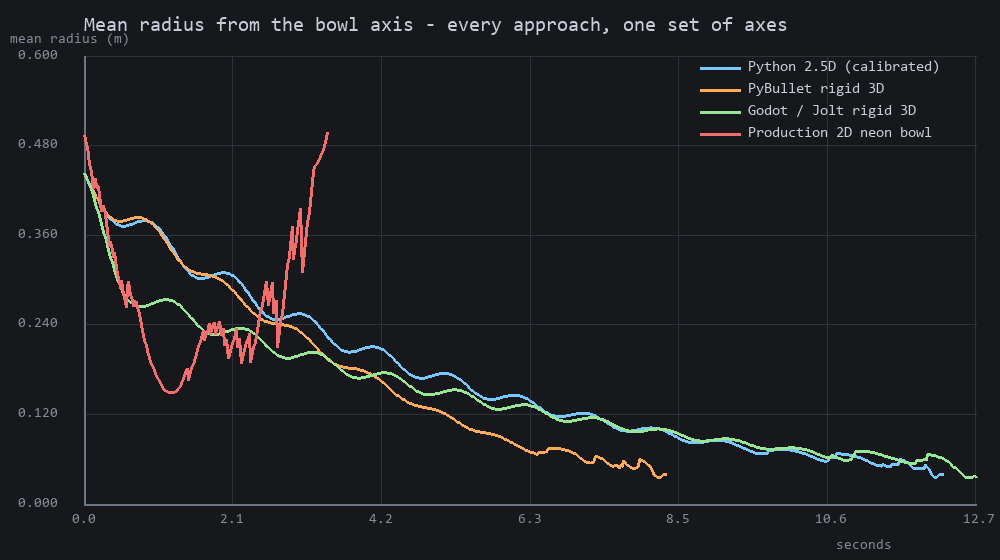
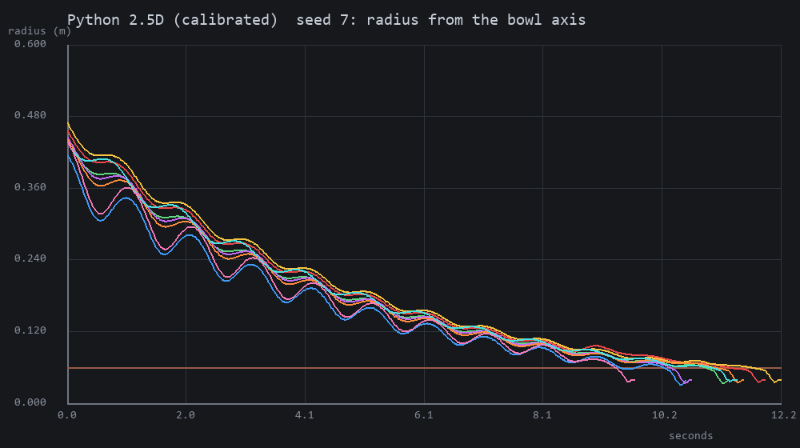
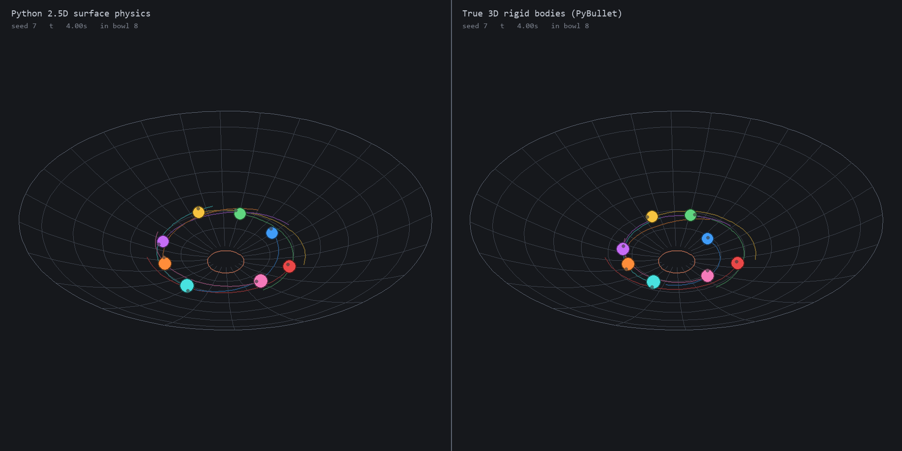

# Bowl physics: 2.5D surface constraint against true 3D rigid bodies

**Branch** `race-physics-lab` · **base** `0013e73` (Neon V1.1) · **research
only** — nothing here has been merged, and no production file has been changed.

The question:

> Can we achieve convincing marble-machine physics while keeping Python
> authoritative, or should this project move to true 3D rigid-body physics?

Answered by building the same benchmark three times and measuring it. The plan
that fixed the benchmark, the metrics and the pass/fail thresholds was written
and committed *before* any prototype existed
([`physics_lab/EXPERIMENT_PLAN.md`](../physics_lab/EXPERIMENT_PLAN.md), commit
`18ebfbd`), so nothing below is a criterion adjusted to fit a result.

**Recommendation: B — move future marble-machine physics to a true 3D engine,
keeping Python authoritative, with PyBullet.** The reasoning is in section 11,
and the case against is in section 12.

---

## 1. The problem, and the measurement that confirms it

The production architecture is 2D pymunk with the third axis derived by the
renderer. `godot/scripts/neon_scene.gd` maps a racer's distance from the
exported bowl centre to a presentation height, and the mapping is honest — but
no mapping can add physics that was never computed.

The experiment plan predicted a specific, falsifiable consequence: because
gravity in the simulation plane is a constant vector rather than the tangential
projection of one, the neon disc has a restoring force on the semicircle where
`sim_y < BOWL_CENTRE_Y` and an *expelling* force on the other, so racers cannot
orbit. Run the lab's own accumulated-angle metric over the real neon replay
(`tools/physics_lab_production_bowl.py`, seed 7, 16 racers):

| | revolutions about the bowl axis |
| --- | --- |
| **Production 2D neon bowl** | median **0.456**, range 0.421–0.542, **none above 1.0** |
| Python 2.5D surface physics | median **6.01**, range 4.88–6.70, all above 1.0 |
| PyBullet rigid 3D | median **4.06**, range 3.30–4.93, all above 1.0 |
| Godot/Jolt rigid 3D | median **6.33**, range 5.34–6.99, all above 1.0 |

0.456 revolutions is not a marble orbiting a bowl. It is a marble entering at
the rim and crossing to the drain — half a turn of geometry. The spread across
sixteen racers is 0.12 of a turn, which is the other half of the tell: every
racer does the same thing, because there is nothing for them to do differently.



The three lab curves oscillate — that is the elliptical orbit — and decay. The
production curve plunges, jitters, and then *rises past its starting radius*
before the series ends at 3.4 s. The rise is an artifact worth naming: the mean
is taken over whichever racers are inside the disc, so as racers leave through
the drain the average is dragged towards the few still out at the rim. That the
artifact is possible at all is the point. In the lab runs no marble ever leaves
except through the drain.

---

## 2. The benchmark

One machine-readable definition, `physics_lab/common/bowl_benchmark.json`, read
by all three prototypes. Neither holds a constant of its own.

| | value | chosen how |
| --- | --- | --- |
| gravity | 9.81 m/s² | real units |
| bowl rim radius | 0.50 m | toy-machine scale |
| rim depth | 0.18 m | rim slope 35.7°, a wall not a ramp |
| profile power | 1.9 | swept; see 2.2 |
| surface max radius | 0.60 m | past it a marble has escaped and is reported |
| drain radius | 0.060 m | 3.0 marble diameters; swept, see 2.2 |
| marble radius / mass | 0.020 m / 0.0838 kg | a 40 mm glass marble |
| marble-on-marble friction | 0.15 | |
| marble-on-bowl friction | 0.50 | must clear (2/7)·tanθ = 0.230; see 5.3 |
| restitution | 0.55 | swept, barely matters |
| physics rate | 240 Hz | swept; trajectories are rate-independent |
| sample rate | 60 fps | matches the production replay |
| duration limit | 30 s | past it the run is a failure and says so |
| seeds | 20, fixed | listed in the configuration |

**Entry.** Eight marbles on the wall between 0.40 and 0.47 m, evenly spaced
with up to 12° of seeded jitter, each prograde at 0.78–1.14 of the *local
circular-orbit speed* plus a 12% inward component, and each already rolling.
Generated once in Python as an explicit `RunSpec` and handed to whichever
engine is about to run — including the ones that are not Python, because two
engines deriving conditions from a shared seed agree only until one of them
draws a random number the other does not.

### 2.1 The one geometric decision everything rests on

The bowl is described as the **centre surface** — where a marble's *centre*
travels — and the collider a 3D engine gets is that surface offset inward by
one marble radius. A sphere resting on the collider therefore has its centre
exactly where the Python constraint would put it. Describing the collider
instead and deriving the centre would have left the experiments comparing bowls
a radius apart at the floor and more than that at the rim, and nothing in the
results would have looked wrong.

The drain is a rolled lip — a circle of one marble radius, tangent to the dish
— not a radius test. Leaving the bowl is therefore a physical event: the lip is
convex, the normal force falls as a marble rolls onto it, and the 2.5D marble
is released when that force reaches zero. Nothing is teleported.

### 2.2 Sweeps

Every point of every sweep is scored over all twenty seeds.

**Damping** (2.5D, chosen: 0.25/s):

| linear damping | drained | median revs | hits/run | all out |
| ---: | ---: | ---: | ---: | ---: |
| 0.10 | 0% | — | 35 | never |
| 0.15 | 100% | 13.5 | 93 | 28.4 s |
| **0.25** | **100%** | **8.2** | **48** | **17.3 s** |
| 0.40 | 100% | 5.4 | 26 | 11.0 s |
| 0.60 | 100% | 3.6 | 22 | 7.6 s |

**Bowl profile power** (chosen: 1.9), and the most interesting sweep in the study:

| power | hits/run | median revs | all out |
| ---: | ---: | ---: | ---: |
| 1.70 | 901 | 8.16 | 16.4 s |
| 1.85 | 388 | 8.32 | 16.9 s |
| **1.90** | **166** | **8.33** | **17.1 s** |
| 1.95 | 82 | 8.27 | 17.2 s |
| **2.00** | **48** | 8.24 | 17.3 s |
| 2.20 | 452 | 7.99 | 18.2 s |
| 2.40 | 810 | 7.84 | 19.0 s |

Collisions collapse at *exactly* power 2.0 and recover on both sides. A true
paraboloid is very nearly a harmonic oscillator: every orbit has the same
period whatever its amplitude, so eight marbles never lap each other. Off the
isochronous point the period depends on energy, the field mixes, and the
benchmark actually exercises the collision handling it exists to compare. 1.9
is also the power `neon_scene.gd` already draws the production bowl with, which
is a pleasant coincidence and not a reason.

**Drain diameter** (chosen: 3.0 marble diameters):

| drain radius | in diameters | drained | stuck | all out | largest energy rise |
| ---: | ---: | ---: | ---: | ---: | ---: |
| 0.030 | 1.5 | 41% | 92 | never | **202 J** |
| 0.040 | 2.0 | 82% | 29 | 21.1 s | 0.60 J |
| 0.050 | 2.5 | 100% | 0 | 18.7 s | 0.003 J |
| **0.060** | **3.0** | **100%** | **0** | **17.1 s** | 0.0003 J |
| 0.080 | 4.0 | 100% | 0 | 14.5 s | 0.0 J |

At 1.5 diameters the field genuinely arches across the hole, and the 202 J is a
real finding about the 2.5D model rather than about the drain: its positional
overlap-correction pass becomes an **energy source** when marbles are wedged.
Three diameters is the first size with margin, and it is close to what the
production neon course already uses (220 px against a 60 px racer, 3.67).

**Physics rate.** Trajectories are essentially rate-independent — all-drained
17.06 / 17.08 / 17.08 s and median revolutions 8.33 at 120 / 240 / 480 Hz. Only
the collision *count* moves (89 / 166 / 321), because contact-begin is sampled
at the tick rate and a pair that separates and re-touches inside one tick counts
once. Collision counts are therefore only comparable at a matched rate.

---

## 3. Approach A — Python 2.5D surface physics

`physics_lab/surface25d/sim.py`. Python keeps the physics.

**The chart.** A marble in contact with the bowl is two numbers, its horizontal
position; its height is evaluated from the surface, never integrated. The
constraint is not enforced by a solver, a penalty or a projection — it *is* the
coordinate system. That disposes of four of the failure modes in section 23 of
the brief before any physics is written: sinking, hovering, drift and tunnelling
are not expressible. `test_the_surface_constraint_is_exact` asserts **zero**
error, not small error, and it holds.

**The equations.** For `y = f(x, z)` under gravity, Newton plus the constraint
gives, in closed form,

```
lambda / m_eff = ( g / (1 + c)  +  K ) / ( 1 + |grad f|^2 )
x_ddot         = -f_x * lambda / m_eff
K              = u_dot^T H u_dot
```

The horizontal acceleration is exactly the tangential projection of gravity —
the `K = 0` case is algebraically identical to `g - (g·n)n` in the chart — plus
the curvature term that holds a fast marble against a curved wall. `lambda` is
the normal force, a number the prototype *has*, which is what lets the drain be
an event rather than a threshold. Rolling enters as `m_eff = (1 + 2/5) m`,
which is algebraically the familiar `(5/7) g` for a sphere on an incline.

**Two tests carry this section.** A marble launched at the analytically derived
circular-orbit speed holds its circle to 6 µm over four turns at 240 Hz, and the
wander shrinks with the step — so what is left is discretisation, not a wrong
orbit condition. And a marble at rest on the wall accelerates at exactly
`(5/7) g sin θ`, out of code containing neither `5/7` nor a sine.

**Collisions.** Resolved as genuine 3D impulses. The response of a constrained
marble to a 3D impulse is `dV = T A⁻¹ Tᵀ J`, so the effective inverse mass along
a contact normal is `nᵀ T A⁻¹ Tᵀ n` — which is singular along the surface
normal (a marble cannot be pushed into the bowl) and correctly makes a marble
hard to shove uphill and easy to shove along the wall. The projection onto each
marble's allowed tangent state falls out of the algebra rather than being
applied afterwards.

**Integrator.** Velocity Verlet with a velocity predictor, not symplectic
Euler. Euler was written first and is the obvious choice for a constrained
system, but the acceleration depends on the velocity through the curvature
term, which breaks exactly the property Euler is chosen for. Measured on a
passive orbit at 240 Hz:

| rate | symplectic Euler | velocity Verlet |
| ---: | ---: | ---: |
| 60 Hz | +3.68e-3 | −2.54e-5 |
| 120 Hz | +1.86e-3 | −4.38e-6 |
| 240 Hz | +9.35e-4 | −8.44e-7 |
| 480 Hz | +4.69e-4 | −1.80e-7 |

First order against second, about 1100× better at the benchmark rate, for one
extra evaluation per tick. The remaining drift is also *negative*.

**Stated approximations.** Rolling inertia is a scalar (exact on a plane; the
error here is the marble radius over the surface radius of curvature, ~3% at the
rim). No gyroscopic terms. **Rolling is assumed, never checked** — there is no
slip condition, so a marble that a real wall could not grip still rolls. The
contact point traces the offset surface, whose arc length differs slightly from
the centre path's.

---

## 4. Approach B — true 3D rigid bodies

### 4.1 Engine choice

| Candidate | Verdict |
| --- | --- |
| **PyBullet 3.2.7** | **Primary.** Keeps Python authoritative, so the whole existing pipeline survives. No cp313 Windows wheel: pip built the 76.8 MB source tarball against MSVC 2022. It works, and it is a compiler dependency on every machine that would ever run a simulation. |
| **Godot 4.7.2 / Jolt** | **Cross-check.** Already in the pipeline as the renderer. Making it authoritative inverts the architecture, so it is measured to answer "what would moving authority downstream buy", not assumed to be the answer. Its own project under `godot/physics_lab/`, because `physics/3d/physics_engine` is read at startup and cannot be set from the command line. |
| pymunk / Chipmunk | Rejected: it is 2D, and it is the thing under investigation. |

### 4.2 Four bugs, each of which produced a plausible physics result

Worth recording, because every one of them would have been reported as a
finding about rigid-body physics.

1. **A silently truncated collider.** PyBullet's inline `createCollisionShape`
   marshals through a fixed command buffer — 8192 vertices, 32768 indices — and
   a larger mesh arrives truncated with no error. It got 26624 vertices, the
   bowl had no collider, the marbles fell through the world, and the run
   recorded 0.14 revolutions. The collider goes through an OBJ file now.
2. **Wrong working scale.** Bullet's default collision margin is 0.04 world
   units — *twice* this marble's radius. A marble placed at rest on the wall was
   flung from radius 0.30 to 0.43 in half a second. The benchmark is now
   simulated at 25× and reported at 1×; lengths, velocities and gravity scale
   together so time is unchanged and every trajectory is geometrically similar.
3. **A phantom cone.** The drain shaft rings were appended after the dish rings
   instead of before them, so the triangle strip joined the outermost dish ring
   to the top of the shaft, and the collider contained a cone running from the
   rim straight down to the drain. Marbles wedged between the real dish and the
   phantom one and stopped dead on the wall — which in a summary table reads
   exactly like "this engine has too much friction".
   `test_no_triangle_spans_the_bowl` now catches it.
4. **A friction combine rule.** Bullet multiplies the two bodies' friction, so
   setting both to the benchmark's 0.15 gives 0.0225 against a wall needing
   (2/7)·tanθ = 0.230 to sustain rolling. The marbles skidded the whole way
   down and the rolling ratio came out at 1.58. Jolt uses `sqrt(a·b)`, so the
   numbers that produce a given coefficient are *different in the two engines*.

### 4.3 The tessellation trade-off, which has no 2.5D equivalent

A rigid-body sphere loses energy at every triangle edge it rolls over. This was
isolated on a flat trimesh with all damping explicitly zeroed: a perfectly
rolling sphere keeps **100.0%** of its speed on an analytic plane, **94.2%** on
a mesh with triangles 5× its diameter, and **50.0%** on a mesh with triangles
its own diameter. So a *finer* collider is a worse one.

Measured on the bowl, circumferential resolution against the orbital energy
half-life and the worst sagitta (the gap between polygon chord and true circle):

| segments | triangles | sagitta | as % of marble radius | half-life |
| ---: | ---: | ---: | ---: | ---: |
| 128 | 34560 | 0.18 mm | 0.9% | 1.20 s |
| 96 | 25920 | 0.33 mm | 1.6% | 1.50 s |
| **64** | **9088** | **0.74 mm** | **3.7%** | **1.76 s** |
| 48 | 12960 | 1.31 mm | 6.6% | 2.10 s |
| 32 | 8640 | 2.95 mm | 15% | 3.22 s |

Meridian ring count barely matters, because an orbiting marble crosses radial
edges and not ring ones. 64 segments is where smoothness and dissipation cross.

### 4.4 The dissipation floor

The consequence: **PyBullet cannot run the benchmark's own dissipation.** With
`linearDamping`, `angularDamping`, `rollingFriction` and `spinningFriction` all
at exactly zero, a marble in this bowl still winds down with a 1.92 s energy
half-life. The benchmark's chosen 0.25/s corresponds to 2.78 s. There is no
setting that gets there.

Godot/Jolt does **not** have a comparable floor: at zero damping its marbles
were still orbiting at 15.5 revolutions when the 30 s limit stopped the run.

---

## 5. Making the comparison fair

### 5.1 Calibration

Since the coefficient cannot be matched, the *observable* is
(`tools/physics_lab_calibrate.py`): a single marble, no collisions, and the
2.5D damping bisected until its energy half-life matches PyBullet's floor.

| | configured damping | half-life |
| --- | ---: | ---: |
| PyBullet (floor) | 0.0 | 1.917 s |
| 2.5D at the benchmark's own figure | 0.25 | 2.783 s |
| **2.5D calibrated** | **0.3594** | **1.933 s** (0.87% apart) |

Godot/Jolt is run at the benchmark's own 0.25 instead, because it can be.

### 5.2 What is still not identical

Stated plainly, because it bounds every conclusion below.

* **Collision counts are not comparable across engines.** Contact-begin is
  sampled at the tick rate, the three engines report contacts differently, and
  the Godot harness uses `get_colliding_bodies()`, which appears to
  under-report short contacts (6 per run against PyBullet's 21 and the 2.5D
  model's 64 on the same seeds). Treat the Godot figure as unusable.
* **Dissipation reaches the marbles differently.** The 2.5D model applies an
  exponential decay to velocity. PyBullet's loss is contact-generated, so it
  concentrates where a marble is in firm contact.
* The calibration is a single-marble measurement; with eight marbles the
  full-run drain times still differ (12.0 s against 8.4 s), so PyBullet's
  dissipation grows faster than the 2.5D model's once contacts are involved.

---

## 6. Results, 20 seeds each (6 for Godot)

| | 2.5D (benchmark) | 2.5D (calibrated) | PyBullet | Godot/Jolt |
| --- | ---: | ---: | ---: | ---: |
| runs / marbles | 20 / 160 | 20 / 160 | 20 / 160 | 6 / 48 |
| drained | **100%** | **100%** | **100%** | **100%** |
| escaped / stuck / failed | 0 / 0 / 0 | 0 / 0 / 0 | 0 / 0 / 0 | 0 / 0 / 0 |
| median revolutions | 8.33 | 6.01 | 4.06 | 6.33 |
| min / max revolutions | 6.83 / 9.34 | 4.88 / 6.70 | 3.30 / 4.93 | 5.34 / 6.99 |
| ≥ 1 revolution | 100% | 100% | 100% | 100% |
| radius decaying | 100% | 100% | 100% | 100% |
| mean time to drain | 15.49 s | 11.05 s | 7.45 s | 11.70 s |
| min / max drain time | 12.90 / 17.65 s | 8.97 / 12.57 s | 5.90 / 9.19 s | 9.88 / 12.99 s |
| all-drained time | 17.08 s | 12.00 s | 8.45 s | 12.63 s |
| collisions / run | 166 | 64 | 21 | 6 (unreliable) |
| worst marble overlap | **0 m** | **0 m** | 3.1e-4 m | 0 m |
| worst surface penetration | **0 m** | **0 m** | 5.8e-4 m | 4.1e-4 m |
| worst hover above surface | **0 m** | **0 m** | 6.7e-3 m | 1.8e-3 m |
| mean rolling ratio (1 = rolling) | 1.00001 | 1.00001 | 1.0051 | 0.9893 |
| unexplained energy rises | 2 | 6 | 136 | 40 |
| largest such rise | 0.00025 J | 0.0011 J | 0.048 J | 0.021 J |
| longest drain stall | 2.25 s | 1.55 s | 1.33 s | 2.05 s |
| wall clock per run | 0.70 s | 0.52 s | 0.44 s | **13.13 s** |

**Every approach passes every believability criterion set in section 10 of the
plan.** Median revolutions ≥ 1.5 (all far above), ≥ 60% of marbles above one
revolution (100%), radius decaying for ≥ 80% (100%), ≥ 90% drained (100%), no
escapes, no NaN, no tunnelling, no sustained overlap beyond 5% of a radius.



Eight marbles, each showing the orbital oscillation in radius superimposed on a
steady decay to the drain (red line). That is what section 26 asks for and it
is what all three produce.

### 6.1 Failure behaviours from section 23, scanned for explicitly

| | result |
| --- | --- |
| hockey-puck sliding | none. Rolling ratio 1.00001 / 1.005 / 0.989. Visible in the videos via the pole marker on each marble |
| straight roads to the drain | none. 4–6 revolutions against the production bowl's 0.46 |
| immediate radial collapse | none. See the radius plots |
| unrealistic constant-speed circles | none. Radius oscillates within each orbit |
| energy increasing without cause | 2–136 frame-to-frame rises across 20 runs, largest 0.048 J against ~1.7 J starting energy. In the 2.5D model these are the positional-correction pass; at a 1.5-diameter drain it reaches 202 J and becomes a real failure |
| severe jitter | none at the chosen settings |
| indefinite bouncing | none |
| drain clogging forever | none at 3.0 diameters; genuine and persistent at 1.5 |
| tunnelling | none |
| spheres overlapping | 2.5D exactly 0; PyBullet peak 3.1e-4 m (1.5% of a radius) |
| exploding contacts | none |
| surface penetration | 2.5D exactly 0 by construction; PyBullet 5.8e-4 m, Jolt 4.1e-4 m |
| teleportation | none. Drain transition asserted continuous |

---

## 7. Determinism

SHA-256 over the raw IEEE-754 bytes of every sampled position, velocity,
orientation and spin, taken before any rounding for storage.

| approach | seeds | in-process repeats | cross-process repeats | unique digests | unique drain orders |
| --- | ---: | ---: | ---: | ---: | ---: |
| 2.5D | 7, 31, 149, 163 | 20 each | 20 each | **1** | **1** |
| PyBullet | 7, 31, 149, 163 | 20 each | 20 each | **1** | **1** |
| Godot/Jolt | 7 | 8 | 8 | **1** | **1** |

All three are byte-identical, in one process and across separate interpreter
launches, including on the two seeds with the most collisions. PyBullet needs
`deterministicOverlappingPairs=1`; without it the broadphase pair order depends
on allocation addresses and the solver is order-dependent.

**This is not a cross-machine result.** Everything was run on one Windows 11
machine, one CPU, one PyBullet build compiled locally, one Godot binary. Bullet
and Jolt both use SIMD paths that can differ between architectures and compiler
settings. Section 12 says why that matters more than anything else here.

---

## 8. Performance and scaling

Mean over 5 seeds; "× realtime" is simulated seconds per wall-clock second.

| marbles | 2.5D wall | 2.5D × realtime | PyBullet wall | PyBullet × realtime |
| ---: | ---: | ---: | ---: | ---: |
| 8 | 0.463 s | **25.8×** | 0.405 s | 20.6× |
| 16 | 1.262 s | 9.8× | 0.588 s | **14.0×** |
| 32 | 3.053 s | 4.0× | 1.013 s | **8.2×** |
| 64 | 7.158 s | 1.8× | 1.821 s | **4.8×** |

The 2.5D prototype is faster at eight marbles and collapses beyond that: it is
all-pairs `O(n²)` in pure Python with no broadphase, and 8× the marbles costs
15.5× the time. PyBullet costs 4.5× for the same 8× — near-linear, with a C++
inner loop. The 2.5D figure is *not* optimised and a broadphase would help, but
it would still be Python.

**Godot/Jolt runs at about 1× realtime** (13.13 s of wall clock for a 12.6 s
bowl, including ~2 s of process launch). That is 20–30× slower than either
Python-authoritative option and it is disqualifying for seed search on its own:
a thousand-seed search would take most of a day where PyBullet takes about
twenty minutes.

Against the plan's speed criterion — a 20 s bowl in ≤ 4 s — the 2.5D model and
PyBullet both pass at 8 marbles with margin; Godot fails by 15×.

---

## 9. What each architecture means for the machines we actually want

This is the section that decides it, and the bowl is the *easiest possible case
for the 2.5D model*.

| element | 2.5D surface constraint | true 3D rigid bodies |
| --- | --- | --- |
| bowl | natural — it is a height field | natural |
| funnel | natural | natural |
| banked curve | natural | natural |
| S-track | natural | natural |
| **tube** | **not expressible.** A tube has two surfaces at the same (x, z) | natural |
| **bridge / overpass** | **not expressible.** Two decks at one (x, z) | natural |
| **vertical drop** | not expressible as `y = f(x, z)`; the gradient is infinite | natural |
| **stacked / overlapping track** | **not expressible.** This is the whole point of a marble machine | natural |
| **elevator** | needs a moving constrained frame | kinematic body |
| **rotating gate** | needs a time-varying surface plus surface-velocity terms in the constraint | kinematic body |
| **tilting platform** | same | kinematic body |
| **moving obstacles** | same | rigid or kinematic body |
| collector | awkward: a pile of marbles at rest is where the positional-correction pass is weakest, and it is where the 202 J appeared |
| | | contact solver's normal job |

A height field `y = f(x, z)` is a **single-valued** function. Every element in
bold above requires two surfaces over one ground point. The 2.5D model could be
extended to an atlas of charts with hand-authored transitions between them, and
each transition would be a seam where a marble hands off between two coordinate
systems — the same class of problem the drain lip solved here in about eighty
lines, once, for one boundary. A marble machine has dozens.

That is the finding. **The 2.5D model is not slightly less general than a 3D
engine; it is unable to express the defining feature of a marble machine.**

---

## 10. Comparison matrix

Scored 1–10 against what the project needs for the next few years, not against
this bowl.

| Criterion | Python 2.5D | PyBullet 3D | Godot/Jolt 3D |
| --- | ---: | ---: | ---: |
| Visual physical realism | 8 | 8 | 9 |
| Bowl behaviour | 9 | 8 | 9 |
| Marble collisions | 7 | 9 | 8 |
| Determinism | 10 | 9 | 9 |
| Simulation speed | 7 | 9 | 2 |
| Replay friendliness | 10 | 9 | 4 |
| Procedural track support | 4 | 9 | 9 |
| Moving obstacle support | 3 | 9 | 9 |
| Multi-level tracks | 3 | 10 | 10 |
| Implementation complexity | 5 | 8 | 6 |
| Production migration risk | 8 | 6 | 3 |
| Long-term flexibility | 3 | 9 | 8 |
| **total** | **77** | **103** | **86** |

Where the 2.5D model scores low, briefly: procedural track, moving obstacles and
multi-level are all the single-valued-height-field limit of section 9. Speed 7
because it wins at 8 marbles and loses badly at 64. Complexity 5 because a bowl
took ~600 lines and every *new kind* of element needs new mathematics rather
than new data. Flexibility 3 for the same reason.

Where PyBullet scores low: determinism 9 rather than 10 because it is verified
on one machine and one locally compiled build. Migration risk 6 because it
replaces pymunk outright, brings an MSVC dependency, and imposes a working
scale. Realism 8 because of the tessellation floor in 4.3–4.4.

Godot/Jolt has the best *physics* of the three and the worst *architecture*:
speed 2 and replay friendliness 4 are what happen when authoritative physics
moves downstream of the replay it should be producing.

---

## 11. Recommendation

**B — move future marble-machine physics toward a true 3D engine, keeping
Python authoritative, with PyBullet.**

The evidence:

1. Both prototypes clear every believability threshold set before the work
   started. This is not a case where one approach fails.
2. The 2.5D model is slightly *better* on this bowl — more revolutions, exactly
   zero penetration, two orders of magnitude fewer energy artifacts. On a bowl.
3. A bowl is the best case for it. Section 9 is decisive: a tube, a bridge, a
   vertical drop and a stacked track are not expressible as a single-valued
   height field, and those are what a marble machine is made of.
4. PyBullet keeps the property this project's architecture is actually built
   on. It is byte-deterministic in-process and cross-process, so
   *Python authoritative → deterministic replay → Godot presentation* survives
   unchanged; only the library behind the first arrow moves.
5. It scales the right way with field size — 4.8× realtime at 64 marbles
   against 1.8× — which is the direction a real machine goes.
6. Godot-authoritative physics is rejected on speed and architecture, not on
   quality. Jolt produced the best-looking bowl of the three.

**C (hybrid) was considered and rejected.** Running the 2.5D model for
surface-like sections and a rigid-body engine for the rest means two physics
systems, two determinism stories, and a hand-off at every section boundary
between a constrained marble and a free rigid body. The drain lip in this lab is
one such hand-off and it took real care to get right. A machine would need
dozens, and each is a place a marble can gain energy or fall out of the world.

**What to do next, before committing to it:**

* Test cross-machine determinism (section 12).
* Prototype *one* element the 2.5D model cannot do — a tube or a two-level
  crossing — to confirm the geometry pipeline, not the physics.
* Decide the working scale for the project deliberately, once. It is a global
  choice and retrofitting it is painful.
* Establish how a bowl-sized collider gets authored and tessellated, since 4.3
  shows the mesh resolution is a physics parameter and not an art one.

**Nothing has been migrated.** Production simulation, the hero course, the
replay schema and the renderer are untouched, as section 38 of the brief
requires.

---

## 12. The biggest remaining uncertainty

**Cross-machine determinism.** Everything in section 7 was measured on one
Windows 11 machine, one CPU, one locally compiled PyBullet, one Godot binary.
Bullet and Jolt both use SIMD paths whose results can differ with architecture,
compiler and flags.

It matters more than anything else here because of what the pipeline does with
a replay: hundreds or thousands of seeds are scored, the strongest is selected,
and *only that one* is rendered. If the search runs on one machine and the
render on another, and the two disagree in the sixteenth decimal on tick one,
the rendered run is not the run that was chosen. The current pymunk pipeline has
the same exposure in principle — Chipmunk is also C — but it has years of
practice behind it and this would not.

The test is cheap and cannot be run from here: the determinism harness already
exists (`tools/physics_lab_determinism.py --child` prints one digest), so it is
one command on a second machine and a string comparison.

Two smaller ones:

* **The dissipation floor (4.4) constrains machine design.** A long banked run
  or a large spiral will lose energy to its own collider tessellation, and the
  cure — coarser triangles — makes the surface visibly polygonal. Jolt does not
  appear to share this, which is worth understanding before settling on Bullet.
* **Collision counts are not comparable between engines** (5.2), so "does a 3D
  engine make a more interesting race" is not answered by this study.

---

## 13. Artifacts

**Videos** (gitignored, under `output/physics_lab/video/`):

| | path |
| --- | --- |
| Approach A | `output/physics_lab/video/surface25d_bowl.mp4` |
| Approach B | `output/physics_lab/video/rigid3d_bowl.mp4` |
| Side by side | `output/physics_lab/video/bowl_comparison.mp4` |

Same camera, same framing, same marble colours, same clock; both halves of the
comparison advance by output frame index so they always show the same instant,
and the shorter run holds its last frame rather than cutting away — an empty
bowl beside a full one being the difference the video exists to show.



**Committed validation** under `docs/validation/physics_lab/` (506 KB): radius
and energy plots per approach, the all-approach mean-radius chart, four
side-by-side stills, every sweep, the calibration, the scaling table, the
production-bowl measurement and every determinism report.

**Reproducing it:**

```
python -m venv .venv
.venv/Scripts/python -m pip install pymunk pygame pytest pybullet

.venv/Scripts/python tools/physics_lab_bench.py --approach surface25d --all-seeds
.venv/Scripts/python tools/physics_lab_calibrate.py
.venv/Scripts/python tools/physics_lab_bench.py --approach rigid3d  --all-seeds --set linear_damping=0.0
.venv/Scripts/python tools/physics_lab_sweep.py linear_damping 0.10 0.15 0.25 0.40 0.60
.venv/Scripts/python tools/physics_lab_determinism.py --approach rigid3d --seed 7
.venv/Scripts/python tools/physics_lab_production_bowl.py
.venv/Scripts/python tools/physics_lab_analyse.py --seed 7 --publish
.venv/Scripts/python tools/physics_lab_video.py
```

The Godot cross-check additionally needs `$GODOT_BIN`.

## 14. Known limitations of this study

* One machine. No cross-machine determinism (section 12).
* Godot was run over 6 seeds, not 20, and its collision counting is unreliable.
* The 2.5D collision loop is `O(n²)` pure Python and unoptimised; its scaling
  numbers are a floor on what the approach could do, not a ceiling.
* Only the bowl was built. Section 9's judgement about tubes, elevators and
  stacked track is an argument from the mathematics, not a measurement —
  correct, but it is the argument and not an experiment.
* Marble-marble collision counts differ enough between engines that no
  conclusion is drawn from them.
* The 2.5D model assumes rolling and never checks a slip condition; on a
  steeper or slicker machine element that assumption would start to matter and
  this bowl does not test it.
